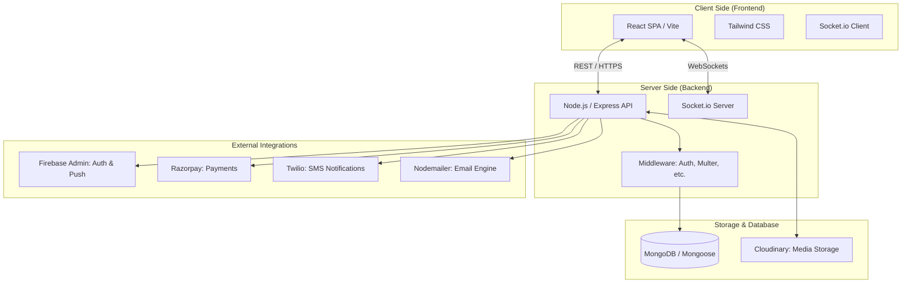
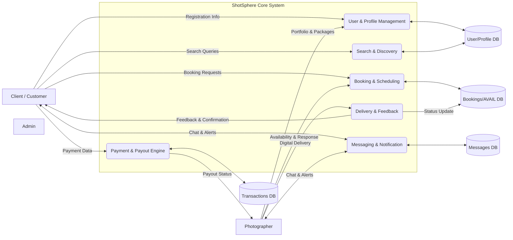

# System Architecture & Data Flow Design

This document outlines the technical blueprint and data movement within the **ShotSphere** platform, illustrating how various components interact to deliver a seamless photography marketplace experience.

---

## 1. System Architecture Diagram

The ShotSphere architecture is built on the **MERN** stack, augmented by industry-leading third-party services for media, payments, and notifications.

### Component Breakdown
*   **React & Vite:** A high-performance frontend for a snappy, app-like feel.
*   **Express API:** A modular backend handling business logic and routing.
*   **MongoDB:** A flexible NoSQL database storing users, portfolios, and booking data.
*   **Cloudinary:** Handles heavy lifting for high-resolution photography uploads and transformations.
*   **Razorpay:** Manages the secure financial flow from client to photographer.
*   **Firebase:** Provides secure user authentication and handles background push notifications.

---

## 2. Data Flow Diagram (DFD) - Level 1

The following diagram illustrates the primary data paths between users and the system processes.

### Primary Data Paths
1.  **Engagement Loop:** Clients query **Process P2** (Discovery) to find photographers. Data is pulled from **D1** (Profiles).
2.  **Booking Loop:** Clients submit requests to **Process P3**. The system checks **D2** (Availability) and triggers **Process P5** (Notifications) to the photographer.
3.  **Financial Loop:** When a booking is accepted, **Process P4** interacts with Razorpay and updates **D3** (Transactions).
4.  **Delivery Loop:** Photographers upload assets via **Process P6**, which notifies the client and updates the booking status in **D2**.

---

## 3. Technology Stack Summary

| Layer | Technology | Purpose |
| :--- | :--- | :--- |
| **Frontend** | React 19 + Tailwind CSS 4 | Responsive UI and Performance |
| **Backend** | Express 5 + Node.js | Robust API and Business Logic |
| **Database** | MongoDB 7 + Mongoose | Data Persistence |
| **Real-time** | Socket.io 4 | Instant Messaging and Alerts |
| **Media** | Cloudinary | Photo Uploads and Image Optimization |
| **Security** | JWT + Firebase Admin | Authentication and Authorization |
| **Finance** | Razorpay | Payments and Payouts |
| **Communication** | Twilio + Web-push | SMS and Desktop Notifications |
